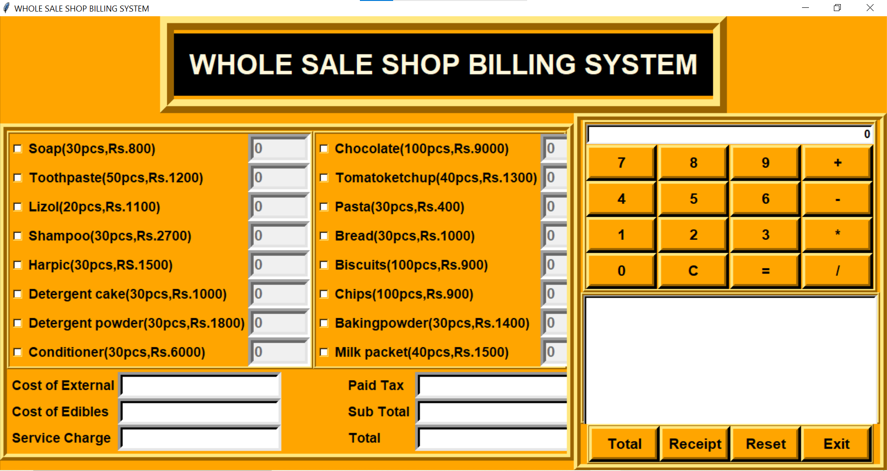
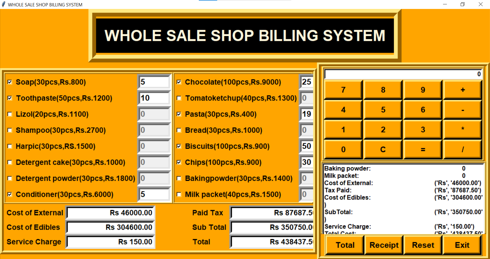
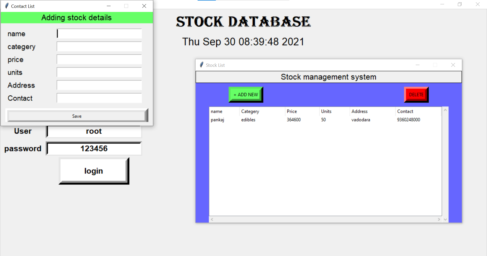
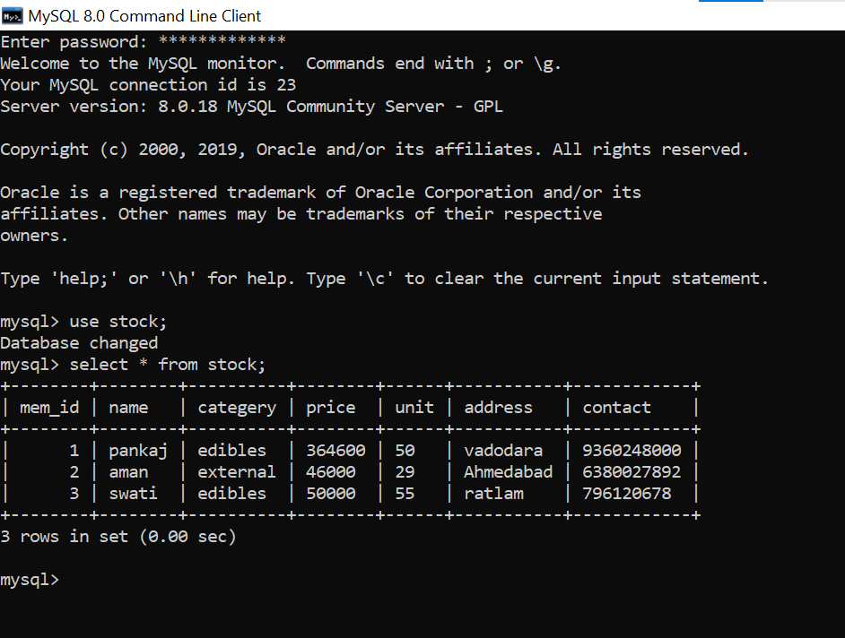

# Stock Simulation App

This is a simple stock simulation application made in python.

# Features :
    - Simulation of WholeSale Shop billing system.
    - Data remain persist with mysql offline database.
    - user friendly interface.

# Sample Outputs 

## Data persistance with mysql DB

# Connect with me :

 - [Linkedin](https://www.linkedin.com/in/pankaj-parihar-63946a20b/)
 - [Instagram](https://www.instagram.com/__pankaj7__/)

